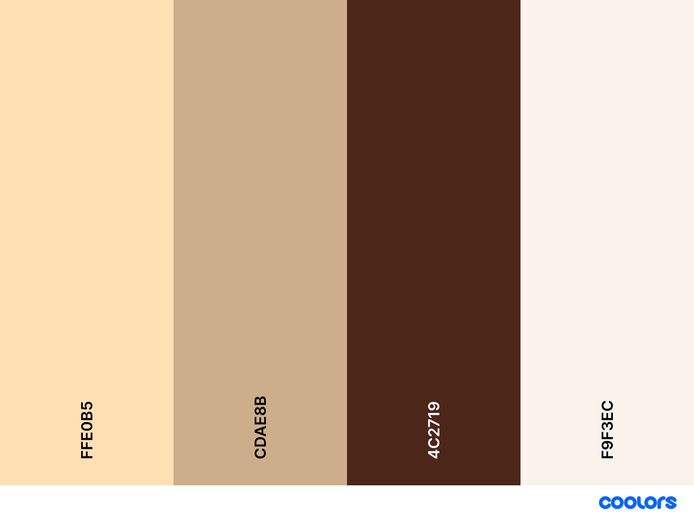

# Vitore's Bakery 

## Project Overview
This website is for Vitore's Bakery and provides a collection of baking recipes presented in an accessible, user-friendly, and responsive format. It's designed to help both novice and experienced bakers find great recipes.

## You can reach the website link [here](https://github.com/Vitore85/PP1)
---
## CONTENTS

- [Vitore's Bakery](#vitores-bakery)
  - [Project Overview](#project-overview)
  - [You can reach the website link here](#you-can-reach-the-website-link-here)
  - [CONTENTS](#contents)
  - [User Experience (UX)](#user-experience-ux)
    - [Key information for the site](#key-information-for-the-site)
    - [User Stories](#user-stories)
      - [Client mission/goals](#client-missiongoals)
      - [First Time Visitor Goals](#first-time-visitor-goals)
      - [Returning Visitors Goals](#returning-visitors-goals)
  - [Design](#design)
    - [Color Scheme](#color-scheme)
    - [Thoughts behind choosing this color scheme:](#thoughts-behind-choosing-this-color-scheme)
    - [Fonts](#fonts)
    - [Imagery](#imagery)
    - [Wireframes](#wireframes)
  - [Features](#features)
    - [General features on each page](#general-features-on-each-page)
    - [Favicon](#favicon)
    - [Header / Nav](#header--nav)
      - [Desktop](#desktop)
      - [Mobile](#mobile)
    - [Footer](#footer)
      - [Desktop](#desktop-1)
      - [Mobile](#mobile-1)
    - [The Homepage](#the-homepage)
    - [Media Section](#media-section)
    - [Video Credits](#video-credits)
    - [Contact Section](#contact-section)
    - [404 Error Page](#404-error-page)
    - [Future Implementations](#future-implementations)
    - [Accessibility](#accessibility)
    - [Languages Used](#languages-used)
    - [Frameworks, Libraries \& Programs Used](#frameworks-libraries--programs-used)
  - [Deployment \& Local Development](#deployment--local-development)
    - [Deployment](#deployment)
    - [Local Development](#local-development)
      - [How to Fork](#how-to-fork)
        - [To Fork the pp1-final repository:](#to-fork-the-pp1-final-repository)
      - [How to Clone](#how-to-clone)
        - [To Clone the pp1-final repository:](#to-clone-the-pp1-final-repository)
      - [Deploy in VSCode](#deploy-in-vscode)
        - [If you use VSCode here are the instructions:](#if-you-use-vscode-here-are-the-instructions)
    - [Code Used](#code-used)
    - [Content](#content)
    - [Acknowledgments](#acknowledgments)

---

## User Experience (UX)

Vitore's Bakery is a recipe website where people can find baking recipes, watch tutorials, know more about Vitore's history, and contact her through a contact form.

### Key information for the site
 - Find recipes
 - Watch Tutorial
 - Relate to the story
 - Contact her

### User Stories

#### Client mission/goals

- Device-friendly design - Responsive layout ensures a seamless browsing experience on all devices, enabling users to access recipes on the go.
- Making baking easy and fun. From quick cookies to fancy cakes.
- To get inspired and motivated
- To access clear information and links 
#### First Time Visitor Goals

- Learn about Vitore’s 20-year journey in baking, and explorefind out how this experience shapes every recipe. Decide if this is the baking community you've been searching for!
- Dive right into delicious recipes with easy-to-follow guides and videos. Plus, find links to baking demos and tutorials on popular platforms like YouTube
- Easily reach out to Vitore via the contact page if you have a question, and expect a warm, friendly response that makes you feel right at home.

#### Returning Visitors Goals
- Stay up-to-date with the newest recipes and baking trends added regularly
- Easy access to contact Vitore directly. Whether you have feedback, need baking advice, or just want to say hi, sending a message
- Enjoy a consistent and comforting experience with each visit. Our website's familiar layout and personal touches make it easy to feel at home, just like your last visit.

## Design

### Color Scheme

### Thoughts behind choosing this color scheme:
This palette draws from the rich, comforting hues of spices and baked goods themselves—colors that evoke warmth and a sense of welcoming. Each color was carefully selected to represent the authenticity and heartfelt warmth that baking brings into homes.
These colors not only create a visually appealing website but also resonate deeply with the sensory experiences of baking. They reflect a return to tradition and authenticity, much like the timeless art of baking itself. This palette promises a genuine, down-to-earth experience—what you see is what you get.

### Fonts
Arial, Sans-Serif

### Imagery

Used a moving image for Home/Index

Used an image for every recipe showing how the cookies/cakes/pastries can look like

### Wireframes
Wireframes were not used for this project

## Features
The page consist a Home page, Recipe section, About section and a Contact section

The entire site is responsive and functions smoothly across all devices

### General features on each page

### Favicon
.svg>)that represents that it as a happy and fun baking site

Favicon is visible on every ingredient

### Header / Nav

The header is visible on every page

#### Desktop

- Consists of a menu to easily navigate on the website
- The link changes color when hovered over, allowing you to easily see what your mouse is pointing at.
- The header is sticky so one i always able to easily found their way to a different part of the website.

#### Mobile

- The header is sticky so one is always able to easily find their way to a different part of the website.

### Footer

The footer is visible on every page

#### Desktop

- Footer with social-link-icons to easy visit social-media account of the creator (links opens in a new tab.)  
- Copyright information in the bottom center.
- Used the same colors for footer as for header to make it follow a consistent theme.

Background is fixed, and all the content in front of it moves without the background moving.

#### Mobile

- Footer with social-link-icons to easy visit social-media account of the creator(links opens in a new tab.) 
- Copyright information in the bottom center.
- Used the same colors for footer as for header to make it follow a consistent theme.

### The Homepage

Homepage consists of a warm welcome text, vibrant colors and a lively image to make it attractive for all people and ages and for them to explore more of the website

### Media Section
- This page consist of an embedded iframe from YouTube
- This also is paired with the Carrot Cake recipe

### Video Credits

- "Amazing Carrot Cake Recipe" by [Preppy Kitchen](https://www.youtube.com/watch?v=zoyhs-EiJxE&t=2s)
- This video provided insights and visuals that contributed to this project. Full credit goes to Preppy Kitchen for their valuable content.

### Contact Section
- The contact section consist of an h2 header and a form for the visitor to contact the artist.
- The input-fields are required which means a user must input information in all fields for it to be able to submit.
- A large textarea for the user to input a larger message for the communication to feel a bit more personal and intimate.
- A big submit button is added below the form to submit the contact form.

### 404 Error Page
- Information displayed when the user inputs a non-existent webpage. 
- Alert and information that the page cannot be reached and also a link to take the user back to the homepage.

### Future Implementations
- A recipe comment and review section where users are able to rate the recipe and/or share their hacks and results
- Online workshops
- An integrated section for displaying social media posts
- Some sort of subscription

### Accessibility

- Semantic HTML have been used for better and clearer accessibility for screen readers. 
- Hover state on links to easier see where the mouse pointer is over.
- Colors with enough contrast to see clearly different elements.
- Used Arial, Sans-Serif fonts for better accessibility to people with dyslexia.
- Recognizable icons on social media links so it's easy to navigate and clear to see.
- Passed contrast checker

### Languages Used
- HTML and CSS were used to create this website. 

### Frameworks, Libraries & Programs Used 
- Git - For version control
- Github - To save and store files for the website
- SVG Repo - For the social-media icons in the footer.
- SVG Repo - To find the favicon used.
- Shutterstock - To find the recipe images

## Deployment & Local Development
The site is deployed using Github Pages - [Vitore's Bakery](https://github.com/Vitore85/PP1)

### Deployment
The instructions to achieve this are below:
1. Log in (or sign up) to Github.
2. Find the repository for this project, pp1-final.
3. Click on the Settings link.
4. Click on the Pages link in the left hand side navigation bar.
5. In the Source section, choose main from the drop down select branch menu. Select Root from the drop down select folder menu.
6. Click Save. Your live Github Pages site is now deployed at the URL shown.

### Local Development

#### How to Fork
##### To Fork the pp1-final repository:
1. Log in (or sign up) to Github.
2. Go to the repository for this project, github.com/Vitore85/PP1.
3. Click the Fork button in the top right corner.

#### How to Clone
##### To Clone the pp1-final repository:
1. Log in (or sign up) to GitHub
2. Go to the repository for this project, github.com/Vitore85/PP1
3. Click on the code button, select whether you would like to clone with HTTPS, SSH or GitHub CLI and copy the link shown
4. Open the terminal in your code editor and change the current working directory to the location you want to use for the cloned directory
5. Type 'git clone' into the terminal and then paste the link you copied in step 3. Press enter

#### Deploy in VSCode
##### If you use VSCode here are the instructions:
1. Click on this icon    to go to extensions.
2. Search for "Live Server"
3. Click Install
4. When installed you might need to restart VSCode.
5. When inside the project you see in the bottom right corner "Go Live"
6. Click on that and the page will open up locally in you browser
7. This

### Code Used
- I used code from the html essentials that I hade written down, Googled some parts where nothing else worked, Youtube hacks, ChatGPT and with a little help from my spouse

### Content
- Content is written by me and with a little english help from ChatGPT and my english friends.
- README.md was inspired by all the different projects and the README.md videos online but not copied
- I might've been inspired and impacted by certain credits and sources to write README as this is completely new to me, but everything is reworked to fit my own project the best

###  Acknowledgments
- Thanks to my spouse who's been dealing with me either crying because I don't understand or shouting from happiness when something worked out after hours of trying
- Thanks to the Swedish Community on Slack for always replying and it's always such a good vibe
